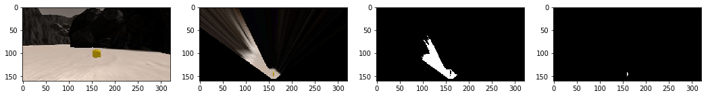
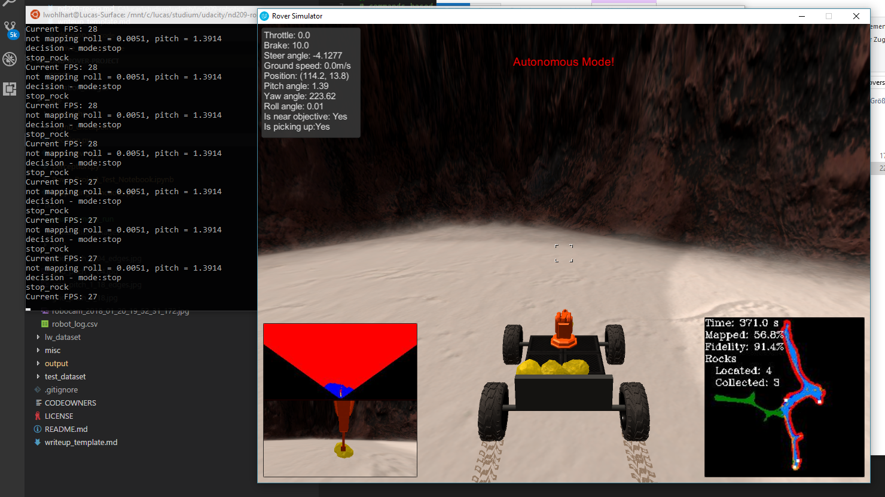

## Project: Search and Sample Return

[grid_transform]: ./calibration_images/example_grid1.jpg
[grid_warped]: ./IMG/warped_grid_image.png
[image3]: ./calibration_images/example_rock1.jpg 

## [Rubric](https://review.udacity.com/#!/rubrics/916/view) Points
---

## Notebook Analysis
In this section I describe the modifications I implemented in the Rover_Project_Test_Notebook which resulted in a valid mapping for the test samples I created using the Simulator.

### Perspective transformation to birds eye view

To establish a perspective transformation from the rovers camera image to a birds eye view perspective the locations of the 4 corner points in the calibration grid are extracted manually and a target rectangle in the transformed image is declared.
Using cv2.getPerspectiveTransform(src, dst) a transformation matrix is generated which can then be used to tranform the camera image (left image) to a top down view (right image).

![calibration grid cell][grid_transform]
![warped map from camera image][grid_warped]

To take into account, that the transformation has to be adapted if the rovers pitch differs from zero, I captured the same scene with slightly different pitches when the rover is stops after a motion and still oscillates a bit.
Using the pitch information the source rect position for the transformation is modified to stabilize the results.
The first column shows the scene and warped target with pitch 0; the second column shows the same scene with pitch 1.18&deg; without pitch correction and the third column shows the pitch corrected warp from the 1.18&deg; tilted source image.

### Image segmentation

To determine which parts of the camera image show navigable terrain, obstacles and rock samples the function color_thresh is modified to take a lower and an upper rgb value threshold to be able to segment the image using certain color ranges.
The following images demonstrate the segmentation of a camera image featuring a rock sample (image 1). First the perspective transform is applied (image 2).
For detecting navigable terrain thresholding the image with only a lower rgb-boundary of (160,160,160) yields good results. Then binary closing is applied to reduce the fuzziness of the segmentation (image 3).
To detect rock samples the rgb value has to lie between (100, 100, 0) and (255, 255, 50), i.e. the red and the green channel have to be high but the blue channel has to be low which in the end is true for yellowish colors (image 4).
The detection of obstacles is basically just the inversion of the navigable terrain threshold masked with the field of view of the rover.

### Helper function for coordinate transformations
Various helper functions are implemented to transform the location of the warped pixels to rover centric coordinates, apply 2d-rotations by a yaw angle to points and calculate the polar representation of cartesian coordinates.

### Data preparation for mapping
Additionally to the already provided data sets in the Databucket, the pitch and the roll angles are added to account for pitch correction and to stop mapping if the rovers roll value exceeds a threshold which would lead to a misinterpretation of the warped camera image resulting in an incorrect mapping.

### Mapping
The function process_image(img) combines the previously described methods to generate a map of the rovers surrounding by analyzing the provided input image and updating the map model based on the gained information.
The Databucket holds a so called occupancy grid map which is a model of the map holding log odds indicating whether or not a certain pixel is undiscovered ( = 0), navigable ( < 0) or an obstacle ( > 0).
First the image is warped to a top down view.
Then a segmentation analysis of the warped image is performed to detect navigable terrain, obstacles and rock samples. The coordinates of the the found features are transformed to a rover centric representation. 

Based on the gained evidence an update for the occupancy grid map is generated making positive updates for the log odds where an obstacle is found and negative updates where navigable terrain is spotted. The influence of the updates are decreasing the further they are away from the rovers location because distant measurements are very noisy and unreliable due to the non-linear warping of the camera image.

Using the current location and orientation (yaw) of the rover, the rover centric coordinates are transformed to global map coordinates and the occupancy grid map is updated based on these coordinates.

For each frame of the input data set an image is assembled containing
1. camera image
2. warped camera image
3. current state of the occupancy grid map combined with rock samples and the map ground truth 
4. segmented warped camera image, depicting the current vision
 

Using the frames of the dataset a video is generated which illustrates the mapping process.
The resulting video can be found in ./output/test_mapping.mp4

---
## Autonomous Navigation and Mapping

### Mapping
For the mapping task of the assignment, the experiments performed in the jupyter notebook provided all required concepts, such that the mapping of the current vision image of the rover to the world map model is implemented as described in the previous section by:
1. pitch corrected perspective transform of the vision image to birds eye view
2. thresholding and binary closing of the warped image for segmentation and detection of navigable terrain, obstacles and rock samples
3. transformation of the detected features to a rover centric coordinate frame
4. preparing an update for the occupancy grid map 
5. transforming the rover centric coordinate frame to global map coordinates and updating the occupancy grid map
6. refreshing the worldmap based on found the current occupancy information and found rock samples
7. extracting distances and angles from the current rover centric vision image for the decision process to enable reactive navigation

---
### Navigation

For the autonomous navigation of the rover, a simple "wall crawler" was developed to reactively navigate and explore the environment.

#### forward mode
In forward mode the rover takes the leftmost half of the available navigable terrain angles and averages them to determine the current steering angle. This technique makes the rover stick to the wall left to it and drive along close to its contour. If the current speed is lower than its desired maximum speed it applies throttle.

If there are currently rock samples detected in the vision image, the navigation angles of the rock sample are used for the steering to make the rover approach the sample.

#### sample nearby
If the rover is close to a rock sample, it brakes and once it's at rest it sends a pick up command

#### stop 
If there is not enough navigable terrain in the current vision image, the rover stops and turns on point towards the right until it finds sufficiently navigable terrain again

#### detecting stuck situation
During forward mode the current velocity is monitored and if eventhough the rover tries to move forward, the velocity doesn't exceed a threshold a stuck counter is incremented up until it the situation is classified as being stuck.

#### resolving stuck 
If the rover appears to be stuck it tries to rotate towards the right and move back to break free from the location where it's stuck.

#### detecting circles
Since the wall crawling mechanism favors steering to the left to stick to a wall, the rover can end up in a situation where it just drives in circles if it has enough space for it. To overcome this behaviour, a counter is increased everytime the rover steers towards the left and if it continously just steers left for a defined period the situation is classified as circling.

#### breaking circle
If the rover detects that it's driving in circles, it stops and reorients towards the right to break the circling behaviour.

#### done
Once all six available rock samples are collected, the rover constanly measures the distance between its current location and its starting point. If it comes closer than 5 units to its starting location it stops, stays at its position and evaluates the task as being done.

---
### Simulation
All simulations were performed using a resolution of 1024x768 with "Good" graphics quality in windowed mode.

Using the rover simulation in autonomous mode, the implementation of the mapping and the navigation algorithm were evaluated.
The rover is consistenly able to perform the wall crawling which in general leads to discovering the entire map. It detects the available rock samples and approaches them until the pickup is performed. If the rover gets stuck it is usually able disentangle itself using the stuck resolving approach.

The following images show a succesfull mapping and collection run which resulted in the rover returning to its start location having collected the six rock samples and a having mapped the entire world.

---
### Discussion

In general the mapping implementation works pretty nicely. It could be improved by better adjusting the perspective transformation to the current viewing angles (pitch and roll) of the rover. The image segmentation yiels a resonable estimate for the navigable terrain, however the obstacle detection (especially in the distant field of view) sometimes produce incorrect estimates of non navigable locations.

Regarding the navigation we could heavily improve the rovers performance by not just reactively navigating using the angles of the current navigable terrain but implementing true global path planing which could lead to a more directed exploration of the world. At the moment the rover doesn't take into account whether or not it has already explored the world in the direction it's currently heading.
Especially when it comes to returning to the starting position of the rover it would make sense to implement a true path planning algorithm which leads back to the origin rather than just stopping once it coincidentally comes close to the desired position.

The resolution of a situation where the rover is stuck could also be improved by not just trying to disentangle it by turning and backing up in a predetermined way but analyzing how to actually resolve the situation.

In forward mode the reactive navigation should actually try to determine if the location ahead of the rover is truely navigable. Just because there's enough navigable terrain in the current field of view doesn't necessarily mean that there's not an obstacle in close proximity of the rover where it could get stuck in.

All in all the current implementation usually solves the task in a reasonable manner but it could definitely be improved.

