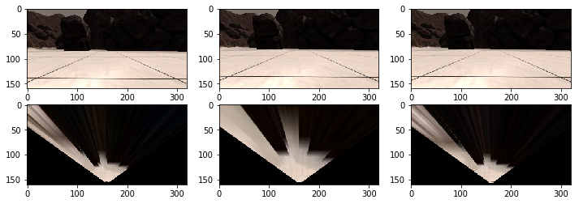
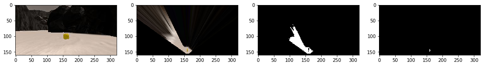

## Project: Search and Sample Return
### Writeup Template: You can use this file as a template for your writeup if you want to submit it as a markdown file, but feel free to use some other method and submit a pdf if you prefer.

---

**The goals / steps of this project are the following:**  

**Training / Calibration**  

* Download the simulator and take data in "Training Mode"
* Test out the functions in the Jupyter Notebook provided
* Add functions to detect obstacles and samples of interest (golden rocks)
* Fill in the `process_image()` function with the appropriate image processing steps (perspective transform, color threshold etc.) to get from raw images to a map.  The `output_image` you create in this step should demonstrate that your mapping pipeline works.
* Use `moviepy` to process the images in your saved dataset with the `process_image()` function.  Include the video you produce as part of your submission.

**Autonomous Navigation / Mapping**

* Fill in the `perception_step()` function within the `perception.py` script with the appropriate image processing functions to create a map and update `Rover()` data (similar to what you did with `process_image()` in the notebook). 
* Fill in the `decision_step()` function within the `decision.py` script with conditional statements that take into consideration the outputs of the `perception_step()` in deciding how to issue throttle, brake and steering commands. 
* Iterate on your perception and decision function until your rover does a reasonable (need to define metric) job of navigating and mapping.  

[//]: # (Image References)

[grid_transform]: ./calibration_images/example_grid1.jpg
[grid_warped]: ./IMG/warped_grid_image.png
[image3]: ./calibration_images/example_rock1.jpg 

## [Rubric](https://review.udacity.com/#!/rubrics/916/view) Points
---
### Writeup / README

#### 1. Provide a Writeup / README that includes all the rubric points and how you addressed each one.  You can submit your writeup as markdown or pdf.  

### Notebook Analysis
In this section I describe the modifications I implemented in the Rover_Project_Test_Notebook which resulted in a valid mapping for the test samples I created using the Simulator.

### Perspective transformation to birds eye view

To establish a perspective transformation from the rovers camera image to a birds eye view perspective the locations of the 4 corner points in the calibration grid are extracted manually and a target rectangle in the transformed image is declared.
Using cv2.getPerspectiveTransform(src, dst) a transformation matrix is generated which can then be used to tranform the camera image (left image) to a top down view (right image).

![calibration grid cell][grid_transform]
![warped map from camera image][grid_warped]

To take into account, that the transformation has to be adapted if the rovers pitch differs from zero, I captured the same scene with slightly different pitches when the rover is stops after a motion and still oscillates a bit.
Using the pitch information the source rect position for the transformation is modified to stabilize the results.
The first column shows the scene and warped target with pitch 0; the second column shows the same scene with pitch 1.18&deg; without pitch correction and the third column shows the pitch corrected warp from the 1.18&deg; tilted source image.

### Image segmentation

To determine which parts of the camera image show navigable terrain, obstacles and rock samples the function color_thresh is modified to take a lower and an upper rgb value threshold to be able to segment the image using certain color ranges.
The following images demonstrate the segmentation of a camera image featuring a rock sample (image 1). First the perspective transform is applied (image 2).
For detecting navigable terrain thresholding the image with only a lower rgb-boundary of (160,160,160) yields good results. Then binary closing is applied to reduce the fuzziness of the segmentation (image 3).
To detect rock samples the rgb value has to lie between (100, 100, 0) and (255, 255, 50), i.e. the red and the green channel have to be high but the blue channel has to be low which in the end is true for yellowish colors (image 4).
The detection of obstacles is basically just the inversion of the navigable terrain threshold masked with the field of view of the rover.

### Helper function for coordinate transformations
Various helper functions are implemented to transform the location of the warped pixels to rover centric coordinates, apply 2d-rotations by a yaw angle to points and calculate the polar representation of cartesian coordinates.

### Data preparation for mapping
Additionally to the already provided data sets in the Databucket, the pitch and the roll angles are added to account for pitch correction and to stop mapping if the rovers roll value exceeds a threshold which would lead to a misinterpretation of the warped camera image resulting in an incorrect mapping.

### Mapping
The function process_image(img) combines the previously described methods to generate a map of the rovers surrounding by analyzing the provided input image and updating the map model based on the gained information.
The Databucket holds a so called occupancy grid map which is a model of the map holding log odds indicating whether or not a certain pixel is undiscovered ( = 0), navigable ( < 0) or an obstacle ( > 0).
First the image is warped to a top down view.
Then a segmentation analysis of the warped image is performed to detect navigable terrain, obstacles and rock samples. The coordinates of the the found features are transformed to a rover centric representation. 

Based on the gained evidence an update for the occupancy grid map is generated making positive updates for the log odds where an obstacle is found and negative updates where navigable terrain is spotted. The influence of the updates are decreasing the further they are away from the rovers location because distant measurements are very noisy and unreliable due to the non-linear warping of the camera image.

Using the current location and orientation (yaw) of the rover, the rover centric coordinates are transformed to global map coordinates and the occupancy grid map is updated based on these coordinates.

#### 1. Run the functions provided in the notebook on test images (first with the test data provided, next on data you have recorded). Add/modify functions to allow for color selection of obstacles and rock samples.

#### 1. Populate the `process_image()` function with the appropriate analysis steps to map pixels identifying navigable terrain, obstacles and rock samples into a worldmap.  Run `process_image()` on your test data using the `moviepy` functions provided to create video output of your result. 
And another! 

![alt text][image2]
### Autonomous Navigation and Mapping

#### 1. Fill in the `perception_step()` (at the bottom of the `perception.py` script) and `decision_step()` (in `decision.py`) functions in the autonomous mapping scripts and an explanation is provided in the writeup of how and why these functions were modified as they were.

#### 2. Launching in autonomous mode your rover can navigate and map autonomously.  Explain your results and how you might improve them in your writeup.  

**Note: running the simulator with different choices of resolution and graphics quality may produce different results, particularly on different machines!  Make a note of your simulator settings (resolution and graphics quality set on launch) and frames per second (FPS output to terminal by `drive_rover.py`) in your writeup when you submit the project so your reviewer can reproduce your results.**

Here I'll talk about the approach I took, what techniques I used, what worked and why, where the pipeline might fail and how I might improve it if I were going to pursue this project further.  

![alt text][image3]

